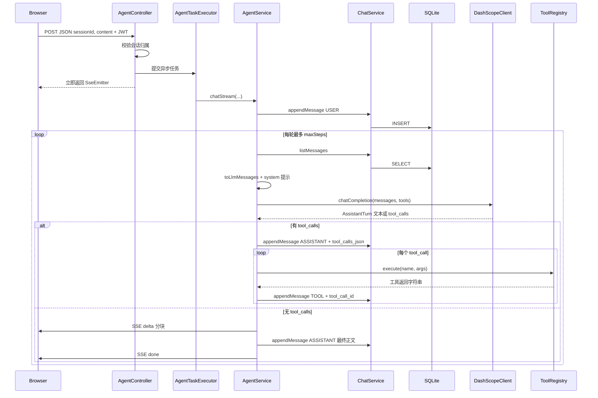

# AI Agent 开发流程与数据流（基于本项目）

本文用本仓库的实现串起「从 HTTP 到模型再到工具再回到模型」的完整链路，便于对照代码阅读。实现细节以源码中的中文注释为准。

---

## 1. Agent 在本项目里指什么

- **普通聊天**：用户一句 → 模型一句，上下文只有历史文本。
- **Agent（工具增强）**：模型除了生成文字，还可以在 **白名单** 内发起 **function calling**；后端 **真实执行** 函数，把结果以 **`tool` 角色消息** 写回上下文，再让模型继续推理，直到输出最终自然语言或达到 **最大步数**。

本项目的编排核心在 [`AgentService`](backend/src/main/java/com/chatagent/agent/AgentService.java)，模型 HTTP 在 [`DashScopeClient`](backend/src/main/java/com/chatagent/llm/DashScopeClient.java)，工具在 [`ToolRegistry`](backend/src/main/java/com/chatagent/tools/ToolRegistry.java) 与各 `ToolExecutor` 实现类。

---

## 2. 端到端数据流（用户点一次发送）

下面以 **流式接口** `POST /api/agent/chat/stream` 为主（非流式 `/chat` 省略 SSE，编排逻辑相同）。



**要点**：

- **JWT 之后** 才会做 **Redis 限流**（[`AgentRateLimitFilter`](backend/src/main/java/com/chatagent/security/AgentRateLimitFilter.java)），仅匹配 `/api/agent/**`。
- 每一轮编排前都从 **数据库重载** 消息，避免内存状态与持久化不一致。
- **工具轮** 一律用 **非流式** `chatCompletion`，便于解析完整的 `tool_calls` JSON。

---

## 3. 核心循环（与代码逐行对应）

下面伪代码与 [`AgentService#chatSync`](backend/src/main/java/com/chatagent/agent/AgentService.java) / `chatStream` 中的 `for` 循环一致：

```
1. 将用户输入写入 DB（role = USER）
2. for step in 1 .. maxSteps:
3.   messages = 从 DB 读出会话全部消息 → 转成 OpenAI 格式 + 首部 system
4.   tools = ToolRegistry 生成的 tools 数组
5.   turn = DashScopeClient.chatCompletion(messages, tools)   // 非流式
6.   if turn 包含 tool_calls:
7.       写入 assistant 行（content 可空，tool_calls_json 必填）
8.       对每个 tool_call:
9.           result = ToolRegistry.execute(名称, 参数 JSON)
10.          写入 tool 行（content = result，tool_call_id = 模型给的 id）
11.      continue   // 进入下一轮，让模型看到工具结果
12.   else:
13.      写入 assistant 最终正文
14.      （流式路径）将正文切块发 SSE delta，再发 done
15.      return
16. 若循环结束仍未 return → 超过 maxSteps，返回错误
```

**`maxSteps`** 来自配置 `agent.max-steps` / 环境变量 `AGENT_MAX_STEPS`，防止模型反复调用工具死循环。

---

## 4. OpenAI 兼容 `messages[]` 与数据库字段（必读）

发给 DashScope 的每条消息大致为：

| role | 典型字段 | 说明 |
|------|-----------|------|
| `system` | `content` | 本项目在内存中拼接，一般不单独存库 |
| `user` | `content` | 用户输入 |
| `assistant` | `content`（可空）、`tool_calls`（数组） | 模型决定调用工具时，`content` 常为空，但必须带 `tool_calls` |
| `tool` | `content`、`tool_call_id` | **必须**与上一条 assistant 里某个 `tool_calls[].id` 一致 |

**本表 [`chat_messages`](backend/src/main/resources/db/migration/) 的映射**：

- `role`：枚举 `USER` / `ASSISTANT` / `TOOL` / `SYSTEM`
- `content`：文本或工具返回串
- `tool_calls_json`：**仅 assistant** 在「要调用工具」那一轮写入，内容为模型返回的 `tool_calls` 数组 JSON
- `tool_call_id`：**仅 tool** 行写入，对应模型分配的 call id

转换逻辑见 [`AgentService#toLlmMessages`](backend/src/main/java/com/chatagent/agent/AgentService.java)；落库接口说明见 [`ChatService#appendMessage`](backend/src/main/java/com/chatagent/chat/ChatService.java)。

---

## 5. 如何新增一个工具

1. 新建类实现 [`ToolExecutor`](backend/src/main/java/com/chatagent/tools/ToolExecutor.java)：
   - `name()` 与 JSON 里 `function.name` 一致。
   - `toolDefinition()` 返回 **完整** tools 数组中的一项（含 `type`、`function.name/description/parameters`）。
   - `execute(argumentsJson, traceId)` 内解析参数、做 **校验与超时**，返回字符串（建议结构化或明确错误信息）。
2. 将该类标为 Spring **`@Component`**，启动时会被收集进 [`ToolRegistry`](backend/src/main/java/com/chatagent/tools/ToolRegistry.java)，无需改注册表代码。
3. 参考 [`CalculatorTool`](backend/src/main/java/com/chatagent/tools/CalculatorTool.java)（安全字符集 + 超时）、[`MockWeatherTool`](backend/src/main/java/com/chatagent/tools/MockWeatherTool.java)（白名单）。

**安全习惯**：禁止把用户字符串直接拼进脚本执行；敏感能力走白名单、限长、鉴权与审计日志（本项目用 `traceId` 关联）。

---

## 6. 流式（SSE）与「假流式」

- **工具阶段**：仍用 **非流式** API，保证 `tool_calls` 解析可靠。
- **最终回复**：当前实现将 **已得到的完整助手正文** 按固定字符数切块，多次发送 `delta` 事件，避免 **同一轮再请求一次流式接口**（省成本；见 `AgentService#emitTextDeltas`）。
- **真 token 流**：[`DashScopeClient#streamCompletion`](backend/src/main/java/com/chatagent/llm/DashScopeClient.java) 已按 OpenAI SSE 格式解析 `data:` 行，可在最后一轮改为直连流式（需自行权衡多一次调用与费用）。

前端用 `fetch` + [`consumeSse`](frontend/src/utils/sse.ts) 解析 `event:` / `data:`，与 Spring `SseEmitter` 对齐。

---

## 7. 可观测与调试

- **`traceId`**：每次 Agent 请求在 SLF4J **MDC** 中放入 `traceId`，日志 pattern 见 [`application.yml`](backend/src/main/resources/application.yml)。
- **结构化日志关键字**：`event=llm_call`、`event=tool_call`，便于在日志平台筛选。
- **限流**：Redis key 形如 `rl:agent:user:{userId}:{yyyyMMddHHmm}`，超配额返回 **HTTP 429**。

---

## 8. 代码地图（快速跳转）

| 职责 | 主要类 |
|------|--------|
| HTTP 入口、SSE 线程派发 | `AgentController` |
| Agent 主循环、消息组装 | `AgentService` |
| DashScope 请求/解析 | `DashScopeClient` |
| 工具定义与执行 | `ToolRegistry`、`ToolExecutor` 实现类 |
| 会话与消息持久化 | `ChatService`、`ChatMessage` |
| 限流 | `AgentRateLimitFilter` |
| 前端 SSE | `frontend/src/utils/sse.ts`、`ChatView.vue` |

---

## 9. 扩展阅读

- 产品范围与 Phase 2（RAG 等）：[AGENT_PROJECT_SPEC.md](AGENT_PROJECT_SPEC.md)
- 运行与环境变量：[README.md](README.md)、[.env.example](.env.example)
