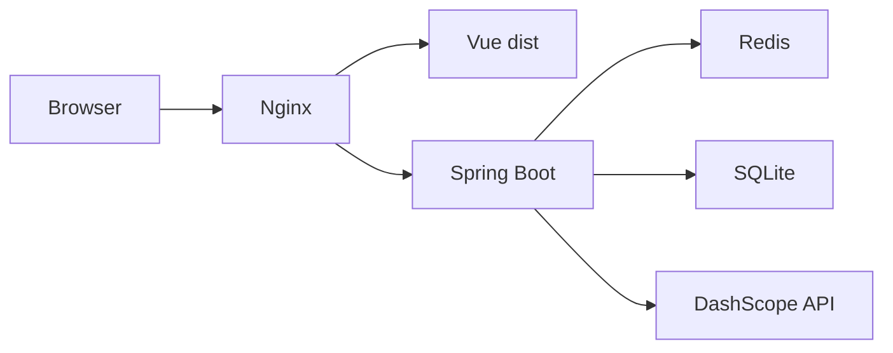

# ChatAgent（Java Agent MVP）

面向面试演示的 **多轮对话 + 工具调用闭环 + SSE** 全栈示例，后端 **Spring Boot 3 / Java 17**，默认对接 **阿里云 DashScope 通义千问（OpenAI 兼容模式）**，持久化 **SQLite**，限流 **Redis**。需求与阶段划分见 [AGENT_PROJECT_SPEC.md](AGENT_PROJECT_SPEC.md)；**Agent 开发流程、数据流与扩展工具步骤**见 [AGENT_DEVELOPMENT_GUIDE.md](AGENT_DEVELOPMENT_GUIDE.md)。

## 架构



## Agent 主循环（后端）

1. 将历史消息（含 `tool_calls` / `tool` 角色）组装为 OpenAI 兼容 `messages`，并附带 `tools` 定义。  
2. 调用 DashScope `chat/completions`（非流式）直到返回 **最终文本** 或 **tool_calls**。  
3. 若存在 `tool_calls`：校验并执行白名单工具 → 写入 `tool` 消息 → 回到步骤 2。  
4. 超过 `AGENT_MAX_STEPS` 则返回友好错误。  
5. **SSE 接口**：工具轮仍用非流式调用；最终助手文本在服务端按块切分后作为 `delta` 事件推送（避免同轮二次调用模型）。`DashScopeClient.streamCompletion` 已实现真实 SSE 解析，可用于测试或后续改为「最后一轮直连流式」。

## 目录

| 路径 | 说明 |
|------|------|
| [AGENT_DEVELOPMENT_GUIDE.md](AGENT_DEVELOPMENT_GUIDE.md) | Agent 流程、数据流、OpenAI 消息格式、加工具、调试 |
| [backend/](backend/) | Spring Boot API、Flyway、Agent、限流 |
| [frontend/](frontend/) | Vue 3 + Vite + Pinia，开发时代理 `/api` |
| [docker-compose.yml](docker-compose.yml) | 仅 Redis |
| [deploy/nginx.example.conf](deploy/nginx.example.conf) | Nginx 反代 + 静态资源 + SSE 相关超时 |
| [.env.example](.env.example) | 环境变量模板（勿提交真实 Key） |

## 本地运行

1. **Redis**：`docker compose up -d`  
2. **环境变量**：复制 `.env.example`，设置至少 `DASHSCOPE_API_KEY`、`JWT_SECRET`（开发可用默认值但生产必须更换）。  
3. **后端**（需 Java 17+）：

```bash
cd backend
export DASHSCOPE_API_KEY=sk-xxxx
export JWT_SECRET=dev-secret-change-in-production-min-256-bits-please-use-long-random-string
mvn spring-boot:run
```

首次启动会创建默认用户 **`admin` / `admin`**（仅当库中不存在该用户名，密码可通过 `ADMIN_BOOTSTRAP_*` 覆盖）。

4. **前端**：

```bash
cd frontend
npm install
npm run dev
```

浏览器访问 `http://localhost:5173`，登录后新建会话即可对话。演示工具调用可尝试：**「计算 123*456」**（`calculator`）、**「上海天气」**（`get_mock_weather`，内置城市白名单）。

## 腾讯云单机部署（摘要）

1. 安装 **JDK 17**、**Redis**（本机或腾讯云 Redis）、可选 **Nginx**。  
2. `cd frontend && npm run build`，将 `frontend/dist` 部署到 Nginx `root`。  
3. `cd backend && mvn -DskipTests package`，用 `systemd` 运行 JAR，通过 `EnvironmentFile` 注入 `.env` 中变量（**不要**把密钥写进仓库）。  
4. SQLite 文件路径建议 `SQLITE_PATH=/var/lib/chatagent/chatagent.db`，目录需可写并纳入备份。  
5. Nginx：参考 [deploy/nginx.example.conf](deploy/nginx.example.conf)，注意 **`proxy_buffering off`** 与较大的 **`proxy_read_timeout`** 以适配 SSE。  
6. 生产请配置 **HTTPS**、收紧 **CORS**（`CORS_ALLOWED_ORIGINS`）、更换 **JWT_SECRET** 与默认管理员密码。

## 主要 API

- `POST /api/auth/login` / `POST /api/auth/logout`  
- `GET /api/health`  
- `POST /api/sessions`、`GET /api/sessions`、`GET /api/sessions/{id}/messages`  
- `POST /api/agent/chat` — JSON 回复，含 `steps`（工具摘要）  
- `POST /api/agent/chat/stream` — `text/event-stream`，事件：`delta`、`tool_start`、`tool_end`、`error`、`done`  

Agent 相关接口受 **Redis 滑动窗口限流**（按用户、每分钟），超限 **HTTP 429**。

## 换模型

设置环境变量 **`DASHSCOPE_MODEL`**（如 `qwen-plus`、`qwen-turbo` 等），并查阅当前模型在 **compatible-mode** 下对 **tools** 的支持情况。

## 面试可讲点

- **Agent 循环**：何时结束、如何避免死循环（`maxSteps`）、工具结果如何回灌上下文。  
- **安全**：JWT、工具白名单、入参校验（表达式字符集、城市白名单）、密钥只走环境变量。  
- **可观测性**：日志中 `traceId`（MDC）、`event=llm_call` / `event=tool_call` 与耗时字段。  
- **演进**：SQLite 并发与扩展限制 → 可平滑换 **MySQL**；限流内存黑名单 → 多实例可迁 **Redis**；RAG / 人工确认见 spec Phase 2。

## 许可

示例项目，按需修改与使用。
