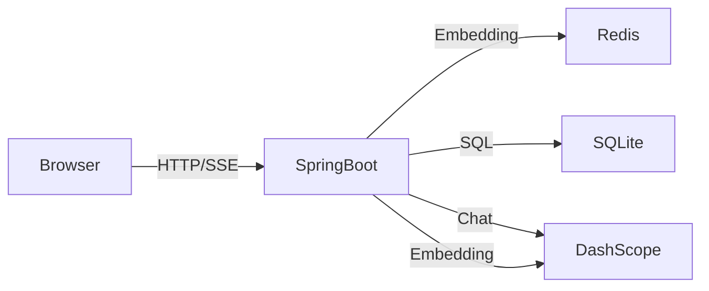

# ChatAgent — 企业 IT 智能助手

企业级 IT 支持助手，基于 **Spring Boot 3 / Java 17** + **Vue 3** + **LangChain4j**，对接 **阿里云 DashScope（通义千问）**，数据持久化 **SQLite**，缓存与限流 **Redis**，链路追踪 **OpenTelemetry + Jaeger**。

## 核心功能

- **多轮对话**：基于 LangChain4j 的 `MessageWindowChatMemory` 实现上下文记忆
- **RAG 知识库检索**：Markdown 文档 → 向量 Embedding → Redis 存储 → 语义检索
- **语义缓存**：相似问题命中缓存，直接返回，省 API 调用
- **用户长期记忆**：向量存储用户个人信息、偏好、知识，跨会话复用
- **模型路由与健康检查**：DashScope / Ollama 双模型自动切换，单模型故障时无缝降级
- **Graph Agent（备选）**：langgraph4j 实现 Human-in-the-loop 工单审批流
- **SSE 流式响应**：实时推送 Agent 思考过程与工具调用状态

## 架构



## 技术栈

| 层级 | 技术 |
|------|------|
| 后端框架 | Spring Boot 3.3 / Java 17 |
| AI 框架 | LangChain4j（默认）、langgraph4j（Graph 引擎） |
| 大模型 | 阿里云 DashScope（通义千问 OpenAI 兼容模式） |
| 向量存储 | Redis（ReJSON-RL） |
| 关系存储 | SQLite + Flyway |
| 前端 | Vue 3 + Vite + Pinia + TypeScript |
| 链路追踪 | OpenTelemetry + Jaeger |

## 目录

| 路径 | 说明 |
|------|------|
| [backend/src/main/java/com/chatagent/it/](backend/src/main/java/com/chatagent/it/) | IT 支持助手核心代码 |
| [backend/src/main/java/com/chatagent/it/model/](backend/src/main/java/com/chatagent/it/model/) | 模型路由与健康检查 |
| [backend/src/main/java/com/chatagent/it/graph/](backend/src/main/java/com/chatagent/it/graph/) | Graph Agent（工单审批流） |
| [backend/src/main/resources/](backend/src/main/resources/) | 配置与数据库迁移 |
| [frontend/](frontend/) | Vue 3 前端 |
| [docs/it-knowledge-base.md](docs/it-knowledge-base.md) | IT 知识库 Markdown |
| [deploy/](deploy/) | 部署配置（Nginx 等） |

## 本地运行

### 1. 启动 Redis

```bash
docker compose up -d
```

### 2. 配置环境变量

```bash
cp .env.example .env
# 编辑 .env，填写 DASHSCOPE_API_KEY
```

### 3. 启动后端（Java 17+）

```bash
cd backend
mvn spring-boot:run
```

首次启动自动创建默认管理员：`admin` / `admin`

### 4. 启动前端

```bash
cd frontend
npm install
npm run dev
```

访问 `http://localhost:5173`，登录后新建会话即可对话。

### 演示工具调用

登录后尝试以下问题：
- **「VPN 连不上了」** → 触发 RAG 知识库检索
- **「帮我创个工单」** → 触发 `generateTicket` 工具
- **「我叫张三，用 MacBook」** → 触发 `saveMemory` 保存用户记忆

## 主要 API

| 接口 | 说明 |
|------|------|
| `POST /api/auth/login` | 登录 |
| `POST /api/chat` | IT 支持助手对话（默认 LangChain4j 引擎） |
| `POST /api/graph/chat` | Graph Agent 对话入口 |
| `POST /api/graph/approve` | 人工审批工单 |
| `GET /api/it-support/models/status` | 模型健康状态 |
| `POST /api/it-support/models/health-check` | 触发模型健康检查 |
| `GET /api/health` | 健康检查 |
| `GET /actuator/prometheus` | Prometheus 监控指标 |

限流：Agent 接口按用户 IP 滑动窗口限流（默认每分钟上限），超限返回 **HTTP 429**。

## 可观测性

- **链路追踪**：所有 LLM 调用、工具调用、RAG 检索均通过 OpenTelemetry + Jaeger 追踪
- **Prometheus 指标**：
  - `chatagent.tool.calls{engine,tool}` — 工具调用次数
  - `chatagent.guardrail.hit{engine,reason}` — 护栏触发
  - `chatagent.agent.summary{engine}` — Agent 执行摘要
- **审计日志**：每次对话输出 `event=agent_summary`，包含 rounds / toolCalls / ragCalls / maxStepsHit

## 配置参考

关键环境变量（详见 `.env.example`）：

| 变量 | 默认值 | 说明 |
|------|--------|------|
| `DASHSCOPE_API_KEY` | — | 必填，阿里云 DashScope API Key |
| `DASHSCOPE_MODEL` | `qwen3.5-flash` | Chat 模型 |
| `REDIS_HOST` | `111.229.177.132` | Redis 地址 |
| `IT_SUPPORT_RAG_TOP_K` | `3` | RAG 返回条数 |
| `IT_SUPPORT_CACHE_THRESHOLD` | `0.5` | 语义缓存相似度阈值 |
| `IT_SUPPORT_MEMORY_ENABLED` | `true` | 是否启用用户长期记忆 |

## 生产部署摘要

1. **JDK 17**、**Redis**（推荐腾讯云 Redis）、可选 **Nginx**
2. `cd frontend && npm run build`，将 `dist` 部署到 Nginx `root`
3. `cd backend && mvn -DskipTests package`，用 `systemd` 运行 JAR，通过 `EnvironmentFile` 注入环境变量
4. SQLite 路径建议 `/var/lib/chatagent/chatagent.db`，纳入备份
5. Nginx 参考 [deploy/nginx.example.conf](deploy/nginx.example.conf)，注意 **`proxy_buffering off`** 与较大的 **`proxy_read_timeout`**（适配 SSE）
6. 配置 **HTTPS**、收紧 **CORS**、更换 **JWT_SECRET** 与默认管理员密码

## 面试可讲点

- **Agent 循环**：何时结束、如何避免死循环（`maxSteps`）、工具结果如何回灌上下文
- **RAG**：Embedding 模型选型、向量分割策略、Redis 向量存储、相似度过滤
- **安全**：JWT、工具白名单、表达式字符集校验、密钥只走环境变量
- **可观测性**：OpenTelemetry Span + Jaeger 追踪、MDC traceId、Prometheus metrics
- **降级与容错**：模型健康检查、Ollama 本地降级、语义缓存加速
- **演进**：SQLite → MySQL、Redis 限流多实例共享、Graph Agent 审批流

## 许可

示例项目，按需修改与使用。
