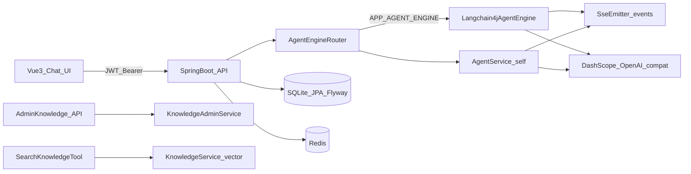

# ChatAgent 简历与面试要点（与仓库代码对齐）

个人项目定位：**可运行的 LLM Agent 全栈 MVP**（多轮对话、工具调用、SSE、持久化、知识库与 RAG 工具、可切换引擎）。下文可直接裁剪进简历；**请把占位链接换成你的真实地址**。

---

## 可验证材料（投递前请补全）

| 项 | 说明 |
|----|------|
| 代码仓库 | 将 `YOUR_GITHUB_REPO_URL` 替换为你的 GitHub（或 Gitee）仓库地址 |
| 本地运行 | 见仓库根目录 [README.md](../README.md)「本地运行」：Redis、环境变量、后端 `mvn spring-boot:run`、前端 `npm run dev` |
| 可选 Demo | 若有公网部署，替换 `YOUR_DEMO_URL`；无则写「本地可运行 + README」即可 |
| 可选录屏 | 1～2 分钟：登录 → 对话 → 触发工具 → 展示流式与侧栏过程 |

---

## 岗位侧重点怎么选（三选一为主）

投递时**主 bullet 选 3～4 条**，其余合并成一句或删掉。

### A. 偏 Java 后端

优先写：**双引擎路由、SSE + 异步线程池、JWT + 会话归属、Redis 限流 429、工具护栏与指标、Flyway/SQLite**。  
少展开 Vue 细节，可写「配套简单管理端/前端联调」。

### B. 偏全栈

优先写：**前后端分离、JWT 流式对话（SSE）联调、会话列表与 Markdown 渲染、过程面板事件、知识库管理页**。  
后端仍保留 1～2 条（护栏或限流）体现完整性。

### C. 偏 AI 应用 / Agent 工程

优先写：**工具调用闭环、RAG 检索工具、知识库上传/索引/版本与评估接口、双引擎（自研编排 vs LangChain4j）配置切换、护栏防滥用**。  
技术栈里明确 **DashScope OpenAI 兼容**与 **LangChain4j**。

---

## 项目名称与一句话（简历用）

- **标题**：`ChatAgent｜LLM Agent 全栈 MVP（个人项目）`
- **一句话**：基于 Spring Boot 与 Vue 的多轮对话 Agent，支持工具调用与 SSE 流式输出，会话持久化，集成知识库管理与向量检索工具；后端可通过配置在 LangChain4j 与自研编排引擎间切换。

---

## 技术栈（按需删减到 6～10 个）

Java 17、Spring Boot 3、Spring Security（JWT）、JPA、Flyway、SQLite、Redis、LangChain4j、SSE（SseEmitter）、Vue 3、Vite、TypeScript、Pinia、DashScope（OpenAI 兼容 API）。

---

## 架构（与代码模块对应，可放作品集一页图）

---

## 简历 bullet 模板（与实现文件对齐，勿夸大）

下列每条均可在仓库中找到对应实现；只写你**亲自跑通、能讲清**的条目。

1. **Agent 主链路与流式**：实现多轮对话、工具调用闭环及结果回灌模型；提供同步与 SSE 两种接口，流式路径使用 `SseEmitter` 与独立线程池异步执行，降低阻塞容器线程的风险。  
   - 参考：`backend/src/main/java/com/chatagent/agent/AgentController.java`、`backend/src/main/java/com/chatagent/agent/engine/AgentEngineRouter.java`

2. **可切换引擎**：通过配置在自研编排（`self`）与 LangChain4j 默认引擎间切换，便于对比实现与渐进迁移。  
   - 参考：`backend/src/main/java/com/chatagent/agent/engine/AgentEngineRouter.java`、仓库根目录 `MIGRATION_TO_LANGCHAIN4J.md`

3. **安全与限流**：JWT 鉴权、会话归属校验；对 `/api/agent/**` 在 Redis 中按用户与分钟桶计数，超限返回 429。  
   - 参考：`backend/src/main/java/com/chatagent/config/SecurityConfig.java`、`backend/src/main/java/com/chatagent/security/AgentRateLimitFilter.java`

4. **工具调用护栏与可观测性**：每轮/总计/单工具调用上限、工具超时等；触发时通过 SSE 发送 `guardrail` 事件，并配合 Micrometer 计数（如 `chatagent.guardrail.hit`）。  
   - 参考：`backend/src/main/java/com/chatagent/config/AgentProperties.java`、`backend/src/main/java/com/chatagent/agent/AgentService.java`、`backend/src/main/java/com/chatagent/agent/engine/Langchain4jAgentEngine.java`

5. **RAG 与管理端**：ADMIN 角色下知识库文档上传、列表、重建索引、版本回滚与评估相关 API；Agent 侧提供基于向量相似度的知识检索工具。  
   - 参考：`backend/src/main/java/com/chatagent/knowledge/KnowledgeAdminController.java`、`backend/src/main/java/com/chatagent/tools/SearchKnowledgeTool.java`

6. **工程化与验证**：Flyway 管理数据库版本；提供 Nginx SSE 相关配置示例与脚本化验证（如护栏场景）。  
   - 参考：`deploy/nginx.example.conf`、`backend/scripts/verify_guardrail.sh`、`doc/AGENT_DEVELOPMENT_GUIDE.md`

**量化建议**：无线上数据时，可写「提供脚本/本地验证流式与护栏行为」；勿编造 QPS。

---

## 「自学」表述（一行即可）

对照官方文档与开源示例，**独立完成**需求拆解、接口与数据模型设计、前后端联调及运行/部署说明，并整理可复用的 Agent 工具接入流程（见 `doc/AGENT_DEVELOPMENT_GUIDE.md`）。

---

## 面试追问清单（与仓库一一对应）

1. **SSE 事件**：`delta`、`plan_*`、`tool_*`、`guardrail`、`error` 分别在什么时机下发，前端如何消费。  
   - `Langchain4jAgentEngine`、`frontend` 中 SSE 消费逻辑。

2. **为何异步线程池**：流式响应提交后线程边界、`response committed` 与异常处理注意点。  
   - `backend/src/main/resources/knowledge/sse-stream-events.md`、security 相关说明文档。

3. **双引擎取舍**：何时用 `self`、何时用 `langchain4j`，迁移与回滚。  
   - `MIGRATION_TO_LANGCHAIN4J.md`

4. **RAG 细节**：分块、嵌入、检索参数 `k` / `minScore`、无命中时的行为。  
   - `SearchKnowledgeTool.java`、`KnowledgeService` 相关实现。

---

## 占位符（复制到简历前替换）

- 仓库：`YOUR_GITHUB_REPO_URL`
- Demo：`YOUR_DEMO_URL`（可选）
